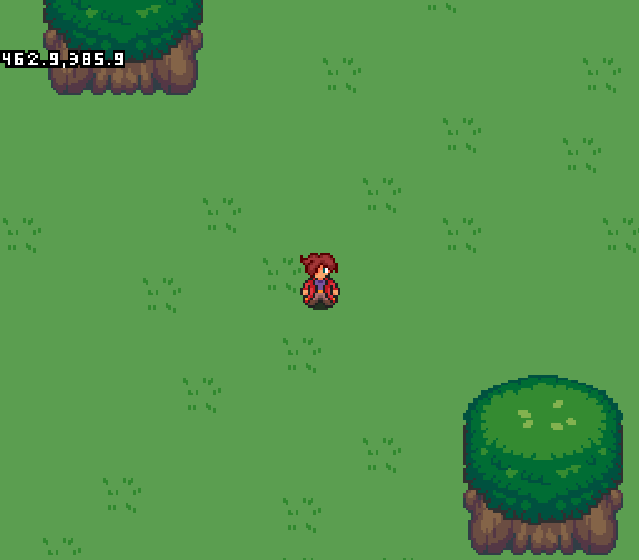
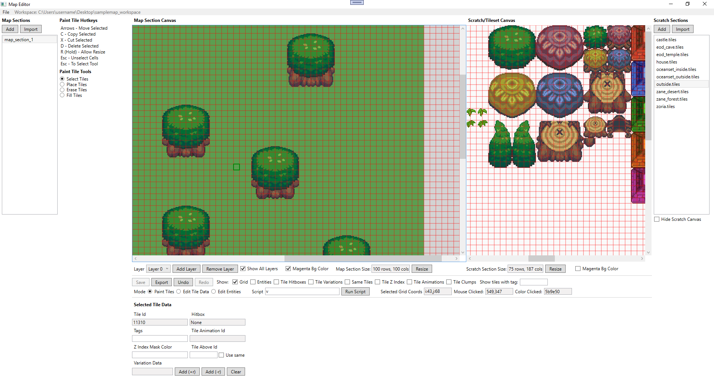
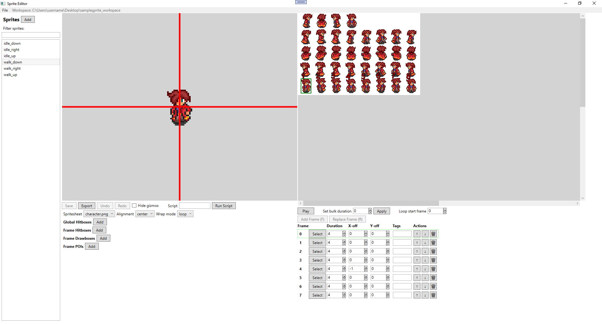

## Overview

Royale2D is a WIP 2D sprite-based battle royale engine with a custom-built sprite and map editor.

Mostly, C# is used. The engine uses SFML.NET (C# bindings for SFML). The editors use WPF. There is also a simple, basic C++ engine sample provided as well.

As mentioned, this project has two main components: the editors, and the game engine.
- For editor docs and readme, see the readme [here](src/Editor/readme.md)
- For the C# engine docs and readme, see the readme [here](src/Engine/readme.md)

For general conventions that apply to all projects, see the doc [here](docs/general_conventions.md)

## Repo Structure

The "assets" folder stores the exported assets from asset workspaces. See editor docs to learn about asset workspaces. The contents of the "sprites", "spritesheets" and "maps" folders would come from exported workspaces. This folder also stores other raw assets directly that are simple enough to not warrant a separate editor workspace (sounds, music, non-sprite images, etc)

The "src" contains the source code for the various components.
- Editor folder contains the main sln and csprojs for the WPF sprite and map editors.
- Engine folder contains the main sln and csproj for the SFML.NET-based game engine.
- Shared is code used by both of the above
- EngineCpp is a basic engine in regular SFML (C++) with a more limited feature set than the SFML.NET/C# engine.

## Screenshots

### Engine

### Map Editor

### Sprite Editor

## License

MIT. Do what ever you want with it!
Assets used are creative commons.