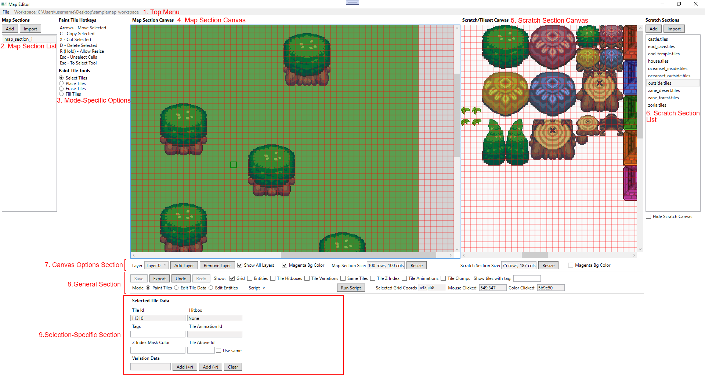

# Map Editor Guide

## Basic Overview

Map editor to create top-down 2D pixel art maps for Royale2D and in general.

The map editor only supports **square** tiles, so things like isometric, angled rhombus tiles are NOT supported.

Here's a list of features supported:
- Create and modify tile-based maps using a standardized set of square tiles. Each tile must be a square (meaning, width and height are the same) and every tile in your workspace/tileset will be of the same size. Layers are supported.
- Place "instances" (generic game objects) in your map. This can represent enemies, collectables, etc.
- Place "zones" (pre-defined rectangular areas) in your map. This can represent areas where music changes, trigger events happen, regions not to scroll into, etc.
- Set metadata for tiles, such as collision hitboxes, tags and more.
- Specify tile animations, which are 1D lists of tile ids that make up an animated tile.
- Specify tile clumps, which are 2D grids of tile ids that make up something of interest to your game engine. For example, tall grass that you can cut that will transform into another cut grass tile clump. Often if your tile size is small (i.e. 8x8) a single tile won't draw out things

## General Terms and Concepts

- **Tile**: Refers to an actual tile. A reusable NxN square box of pixels with a unique integer id in the tileset it's in and other assignable data such as collision hitbox, transparent color, tags, and more. **Do not confuse with cell.** A tile is a "pigeon", a cell is a "pigeonhole".
- **Tile Data**: The data in a tile that isn't the id or pixel data. So hitboxes, transparent color, tags, etc.
- **Tileset**: A set of tiles to be used in map/scratch sections. Each tile in a tileset has a unique id.
- **Map**: Your workspace as a whole represents a "map", a collection of related map sections, that can be connected via Entrance instances.
- **Map Section**: Maps are composed of map sections, your base representation of a game world area. This is best described by analogy. Think of these as Unity scenes, Gamemaker rooms, etc. Consists of a list of 2D grids. Each grid cell has a tile id as a reference to a tile. It's a list of 2D grids to support layers and layers lower in the list index are drawn below. Also has entities (more on that further down). One important note: there cannot be empty cells in the grid. If you want it to be empty (fully transparent) it would be assigned the **Transparent Tile**, which by convention has an id of 0. This was done to simplify code and data structures quite a bit and reduce null ref potential.
- **Scratch Section**: These are map sections that are not to be used by your game engine but are just there to be used as a "scratch pad" where you can freely draw tile patterns and quickly copy/reference them. A good way to get started, if you have tileset PNG files already, is to import these as scratch sections so you can use them as a tile source to draw in the map canvas. These are also useful for laying out tile clumps and tile animations. You can have a dedicated section for those with a certain name for quick reference and clump/animation editing.
- **Section**: The term "section" alone can refer to either of the section types above, since they are the same data model.
- **Cell**: Coordinates in a section tile grid, convention is (i, j) where i is row# and j is col#. Sometimes referred to as "GridCoords" in code
- **Tile Instance**: Combination of a cell and a tile. An "instance" of a tile in your section grid.
- **Tile Animation**: 1D lists of tile ids that make up an animated tile. Each tile id in the animation needs to exist in your tileset. This would also allow you to place different tiles in the same animation to achieve different "time offsets" of tile animations being played in your game engine, so they are not all in sync and look more natural.
- **Tile Clump**: 2D grids of tile ids that make up something of interest to your game engine that it can detect. Could be interactable things like cuttable grass, liftable rocks, etc, if they are too big to be represented in one tile. Can hold references to other tile clumps for "transformations" like tall grass that is cut to turn it into cut grass tile clump. You could in theory use instances instead of tile clumps for a lot of this. But tile clumps have a performance advantage; if you have a ton of grass or bushes in your levels, like a large prairie, it will use way less memory, CPU and GPU because tiles are efficiently rendered and laid out in a grid-like data structure.
- **Instance**: A game object you place on your map, that isn't a tile. Enemies, NPCs, etc. One special type is built in: Entrance, used to connect different map sections (i.e. indoor areas, caves, etc).
- **Zone**: A region in your map (rect coords can be cell or pixel based) of interest.
- **Entity**: Generic umbrella term for instance and zone. Basically, "conceptual things that aren't tiles" that you place on your map.

## First Time Setup

On launch, you'll be prompted to either create a new workspace or open an existing workspace (for context, workspaces are project folders where your assets live). The former lets you import image files representing your tileset, or even an image that has your map PNG already manifested, without any separate tileset png. The latter lets you open an existing workspace.

Creating a new workspace lets you import map section images. The import images prompt accepts a folder, and all PNG images in this folder will be processed, so if you have multiple tilesets (or map PNGs) put them in the same folder. Use the "Scratch/Tileset" folder browse button for importing to scratch sections and use the "Map Section Images Folder" to import to map sections. Both options will create a tileset.

If you want to quickly get started to play around, there should be an provided sample workspace, **sample_map_workspace**, that you can open.

## The Map Editor Interface

1. **Top Menu**: This has a file menu that lets you create or open other workspaces, and displays the current workspace.
2. **Map Section List**: Lists all map sections in your workspace. Switch between them by clicking on the section you want to switch to. One of these is selected at a time and if it has pending changes (i.e. is "dirty"), there will be a * character to the right of its name.
3. **Mode Specific Options**: Displays UI and help text relevant to the current mode. The editor has a concept of a broad, high-level "mode of operation". Each of these modes have their own use cases and requirements and thus have different hotkeys and behavior. There are 3 modes:
    - **Paint tiles**: In this mode, you paint tiles to a section: placing them, erasing them, etc on your sections. It can be thought of as the "artistic mode" of the application, the one where you craft your actual world, creating terrain, vegetation, structures, and whatnot. As such, this mode has many of its own sub-tools, which can be seen in "Mode Specific Options" under "Tile Paint Tools".
    - **Edit tile data**: In this mode, you set tile data in your tileset, like collision boxes of tiles and more. Tile clumps and animations are also managed here since they are just groupings of tiles in your tileset. Frequent use of many hotkey shortcuts are required to be productive in this mode, which can conflict with the other modes' hotkeys, hence it is a standalone mode. This mode does not modify anything in the map sections themselves, just your tileset tiles that they use.
    - **Edit entities**: You add non-tile "entities" to your map section like instances and zones in this mode. You can select them with **Right Click** (as left click is used for tile selection) and use arrow keys to move/resize.
4. **Map Section Canvas** (or simply **Map Canvas**): This is the canvas where you'll be selecting tiles, painting them, etc. You can pan by holding down space and moving mouse. You can zoom in/out with middle mouse.
5. **Scratch Section Canvas** (or simply **Scratch Canvas**): Same as above but for scratch sections.
6. **Scratch Section List**: Same as "Map Section List" but for scratch sections.
7. **Canvas Options Section**: Canvas UI to manage canvas options and modification.
8. **General Section**: General UI not specific to any mode or tool. Some informational, some perform some action.
9. **Selection-Specific Section**: UI related to your current selection (tile, instance, zone, tile clump, or tile animation). Some informational, some perform some action on the selection.

## Common Hotkeys

- **Ctrl+Z**: Undo
- **Space + Mouse Move**: Pan map / scratch canvas
- **Mouse Wheel Up/Down**: Zoom in/out. Zoom will be centered on the current mouse position.

For some hotkeys you may need to gain focus first on the canvas by left or right clicking on it.

## General User Flow

Each mode has a different user flow/story:

- **Paint tiles**: You'll select tiles and press C to copy them, which will enter paint tile mode where you can paint the copied tiles elsewhere by clicking on the canvas you want to paint to. You'll use the other paint tools like fill and erase for further tile painting. You'll use the scratch canvas as a source of tiles and a scratch pad for painting patterns, though you can just as easily use tiles in the actual map canvas as a source of tiles.
- **Edit tile data**: You'll select tiles and press one of many hotkeys to quickly assign tile collision hitboxes (supports square or diagonal) and see highlighted hitbox indicators for tiles in the UI changed in real time. You'll assign tags to tiles like "water", "stairs", "pit", etc. that your game engine would parse and interpret for gameplay purposes. You'll add tile animations and tile clumps from groups of selected tiles (typically you should organize and arrange tiles used in tile animations and tile clumps in separate dedicated scratch sections for easy management).
- **Edit entities**: You'll select instance types and add instances on the map like entrances, enemies, npcs, etc. You'll select tiles and create "zones" out of your selection.

## Design Choices/Rationale

### Implicit Tileset

Your actual tileset is not explicitly laid out anywhere in the UI. It is implicitly represented via the contents of your map/scratch sections. In a production game, there are often a huge amount of tiles (10k+) and it would be infeasible/pointless to list them all out manually in one big list. It is true that you can use the scratch sections/scratch canvas to store your tilesets, like a traditional tile editor, and use them to place tiles in your map sections/map canvas, but there is nothing stopping you from drawing the same tile again in the scratch canvas itself, drawing complex tile patterns in the scratch canvas, or even erasing the tile from the scratch canvas altogether. For all intents and purpose, map sections and scratch sections are the same thing, it's just scratch canvases are not meant to be used by your game engine and are meant to be a fast scratch pad layer to quickly iterate and create re-usable patterns for copy-paste into actual map sections in a second canvas that is side-by-side with the main map canvas.

To add new tiles, you can import map/scratch sections from png images that have your tiles, either in first time setup or at the top of the map/scratch section lists there is a import button you can press. The png file must contain the tiles laid out at exact NxN positions (N=your tileset tile size). If they are offset or padded, it will not account for that. Then, the import process will create a map/scratch section and add tiles to your tileset extracted from that image, ignoring ones that already have the same pixel data (it'll reuse the existing one in your tileset for those).

### Minimize Configuration ("Convention over configuration")

Most existing tile editors out there rely on heavy, rigid tile configuration before you can do anything meaningful. This tile editor attempts to support more a "artistic" mindset/workflow that does not rely on explicit configuration, but implicit intuition. For example, if you want to make a pattern like a hill or tree, just draw out the tiles in a scratch canvas somewhere, then copy paste that bunch of tiles wherever you need. You don't need to save a concept of a "tile pattern" to disk for this, just artistically lay out the tiles in a scratch canvas somewhere. This gives more flexibility and faster iteration.

### Laser Focus And Simplicity

This project is being built for Royale2D and is tailored to its specific needs. I am not trying to build one tile system to rule them all. For example, isometric tiles are vastly different than the square tile system and are not covered in this editor. Thus, this editor definitely won't suit all needs for every project, but it can easily be forked and modified and used as a template, given its simplicity.

# Advanced functionality/concepts

- **Tile Z-Index Fields**: There are some advanced tile fields (i.e. z-index mask color, "layer above" tile, etc) whose sole purpose is to avoid explicit use of layers in the editor by implicitly representing two tile layers in a single tile/layer. This is another complex, implicit use case that can be avoided/ignored if you want to use layers explicitly for tile z-index ordering. These fields can be used to avoid the pain of constant layer switching, or if your map is huge and layers would cause perf issues in the editor, or if your tileset is not designed for layers from the ground up and lacks transparent tile backgrounds. Do note that to the game engine, this "abstraction" does not exist; the export process will auto-generate tiles in separate layers from these fields if set.