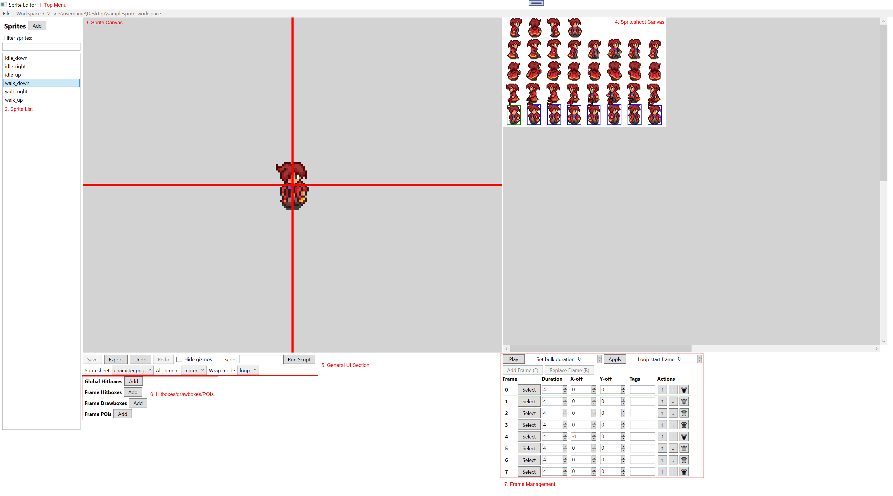

# Sprite Editor Guide

## Basic Overview

The sprite editor is designed to create 2D sprite animations. Each sprite/animation is referred to as a **sprite**. This is the term used for any entity with one or more animation **frames** (rectangular regions in your spritesheet png file and associated data like duration, offset, etc). For example, a character idle sprite, walk animation, and attack animation would each be referred to as a "sprite".

Here's a list of features supported:
- Create/modify 2D sprite animations based off an existing spritesheet png file you provide, by adding and modifying frames
- Set hitboxes in those animations (can be per-frame or global to sprite), which are rectangular regions of interest
- Set POI's (point of interests) in those animations, like a spot where a projectile is fired from, etc. Similar to hitboxes but they are a single point and not a rectangle
- Set "drawboxes" in those animations on a per frame basis, which are additional images rendered on top of the sprite. For example you may want to give your character a separate sword, shield or armor sprite that can be individually shown/hidden in game engine for flexibility without having to "burn" them into a large combination of duplicate sprites.

It does NOT support actual image editing right now. You would do that in a separate tool, like Aseprite. Note that edits to spritesheet images in separate image editors will not be reflected until the editor is re-opened. To quickly reload the editor you can do so in the File menu > Reload Workspace (save your changes first or they will be lost).

Overall, this tool is a lot simpler than the map editor and should have less of a learning curve.

## Workspace/File Structure

As mentioned in the higher-level repo folder readme, a workspace system is used for saving projects. Here is the workspace structure for map editor workspace:

- `sprites` folder: Contains your sprite json files.
- `spritesheets` folder: Contains your spritesheet png files. These are to be pre-provided, as the editor does not create or modify them.

For this tutorial, you can open a sample to play around and get started. There is a sample workspace folder in the application folder that contains the exe, **sample_sprite_workspace**, that you can open. Do that and you'll be taken to the main sprite editor UI.

## The Sprite Editor Interface

1. **Top Menu**: This has a file menu that lets you open other workspaces, and displays the current workspace.
2. **Sprite List**: Lists all sprites in your workspace. Switch between them by clicking on the section you want to switch to. One of these is selected at a time and if it has pending changes (i.e. is "dirty"), there will be a * character to the right of its name.
3. **Sprite Canvas**: Shows the current sprite frame and associated hitboxes/POIs. You can zoom in/out with middle mouse.
4. **Spritesheet Canvas**: Shows the current spritesheet associated with the current sprite. Suports zoom/pan. Click on discrete pixel clumps to select them as a rectangular box, and press F (or the Add Frame button) to add them as a frame.
5. **General UI Section**: For general actions. Save, undo, UI toggles, top-level sprite settings, and more.
6. **Hitboxes/Drawboxes/POIs**: For managing hitboxes/drawboxes/POIs of the sprite.
7. **Frame Management**: For managing all the frames of the sprite animation. Here you can playback the animation, add/remove frames, set frame properties, etc.

## General User Flow

You'll click pixel clumps in the spritesheet canvas, which will select a rectangular region surrounding that pixel clump, then press F to add them as frames. You'll set durations on the frame and use "Play" button to preview the frame animation. You'll use hotkeys below such as WASD or the UI widgets to adjust frame positions/offsets. You'll add hitboxes and POIs in the "Hitboxes/Drawboxes/POIs" section.

## Hotkeys

Generally, for maximum productivity you'll want your left hand on WASD and right hand on the mouse (like playing a first person shooter).

- **Ctrl+Z**: Undo
- **Q/E**: Move to previous/next frame
- **WASD**: Move current frame up/left/down/right. Hold Shift to move 10 pixels at a time. If a hitbox or POI is selected, that is moved instead.
- **Arrow Keys**: If a hitbox is selected, these resize it. Hold Shift to resize bottom right corner instead of top left.
- **G**: Sets a "ghost" of the current frame, which is overlayed on top of the sprite canvas. Useful for aligning other frames or sprites with the one you "ghosted".
- **Escape**: If a hitbox or POI is selected, unselects that. If a ghost is set, removes the ghost. If in Add POI mode, exits the mode.
- **F**: Adds current "pending frame" (selected clump of pixels in spritesheet canvas) as a frame.
- **R**: Replaces current frame with "pending frame" (selected clump of pixels in spritesheet canvas) as a frame.
- **Alt**: Enter add POI mode, turning your cursor into a pen. You can add a POI by clicking somewhere on the sprite canvas. Press Escape to exit the mode.
- **Mouse Wheel Up/Down**: Zoom in/out

For some hotkeys you may need to gain focus first on the canvas by left or right clicking on it.
